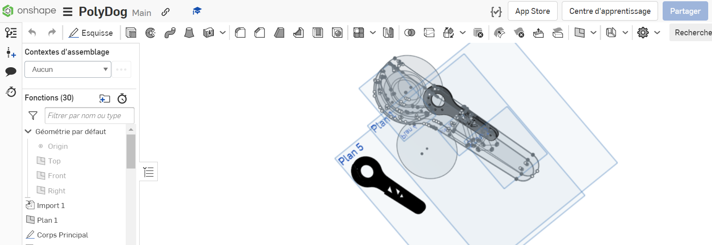

# Première séance : 

début novembre jusqu'au 02/12/2021 

## Emergence de l'idée (2 première séance de novembre)

Pendant les vacances, je me suis beaucoup documenté sur la plupart des projets Arduino les plus connus. Au début j'étais sûr d'une chose, je voulais créer un robot capable de se déplacer. Raphael était du même avis. 

J'ai alors été intérressé par la cartographie d'une pièce par une voiture, le serpent, l'araignée, la self-balancing robot. En retombant par hasard, sur une vidéo du célébre robot Spot de Boston Dynamics, nous n'avons pas hésité longtemps. On fera un robot chien qui naîtra sous le nom de PolyDog.

## Recherche sur les prototypes à notre portée (3e semaine de novembre)

Au fur et à mesure que l'on cherche, on trouve de plus en plus d'exemples de prototypes. Je me suis d'abord penché sur la patte de notre robot, de comment elle pourrait fonctionner.

Deux manière de faire observée :

- Loki le Dev, un développeur spécialisé en système embarqué et robotique (https://www.youtube.com/channel/UC-1W04bMAmzoggRpjDomThw) opte pour 3 actionneurs basé sur un système de parallélogramme :

<figure align="left">
  
</figure>

- KiTty bot lui possède un servo moteur directement sur le genou et je trouve ça moins optimisé, du fait que la patte est plus lourde et l'inertie de la patte est augmentée.

<figure align="left">
  
</figure>

On a opté pour la 1ere option. Je l'ai contacté sur Discord pour qu'il m'aiguille sur quelques points et avoir son avis sur notre projet. Il a été très sympa et nous a beaucoup aidés dans le début de nos recherches, notamment pour trouver des sources d'inspirations.

Enfin, on a appris que le défi, une fois le robot construit, sera de le faire tenir debout en équilibre sur ces pattes à l'aide d'un algorithme complexe basé sur le reverse kinematics. On devra entraîner la demarche du robot sur unity, afin qu'il se déplace convenablement.

## Création et impression des pièces (4e semaine de novembre)

Nous avons créer pour commencer une jambe miniature de notre robot pour manipuler son fonctionnement. J'ai repris une patte d'un robot sur Internet.

Mardi: J'ai changer la taille des pièces sur 3DBuilder. Nous les avons faites imprimer et assembler.

Mercredi : Nous nous sommes repartis les pièces à modéliser sur Onshape. Chacun a fait 3 pièces. 

Voici un exemple de pièce. Celle-ci est celle qu'on appelera le fémur de la patte :

On a réfléchi à combien de servo-moteur nous allons mettre et de quelle manière. Il ne reste plus qu'à les modéliser sur Onshape pour s'assurer du bon fonctionnement de l'ensemble. On souhaitera pour la semaine prochaine imprimer en 3D une des pattes définitive du Robot. Dans l'idéal on aimerai notre robot construit avant les vacances de décembre.

