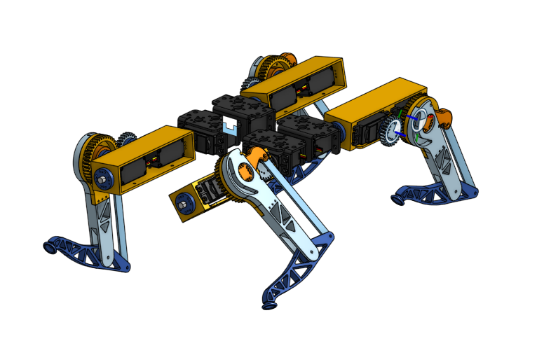
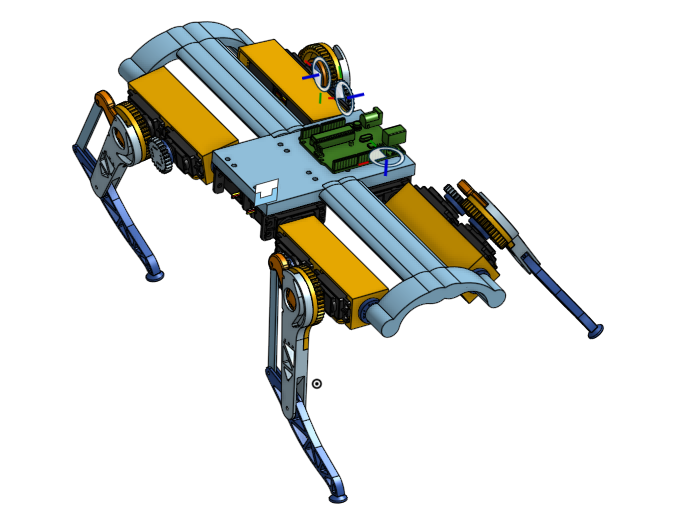
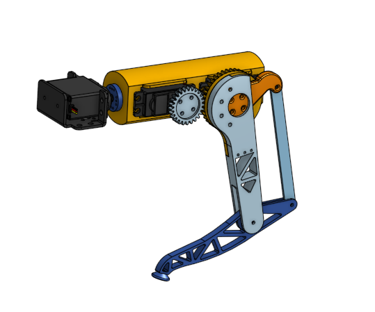

# Séance du 06/01/2022

J'ai continué pendant les vacances l'assemblage des pattes. J'ai incorporé le troisième moteur au reste du module de la patte. Je me suis rendu compte que les 4 pattes ne seront pas les mêmes. J'ai dû appliquer un miroir à certaines pièces et assembler les moteurs de manière différente pour que l'ordre des 3 moteurs soit les mêmes.

Je les ajouter dans un assembleur le robot complet, mon principale soucis maintenant etait de prevoir assez de place pour la carte Arduino et les batteries. J'ai testé certaines distances, j'ai pris 10 cm de largeur pour commencer.

J'ai créé un corps en contexte, j'ai eu un peu de mal a comprendre le concept sur Onshape pour créer une pièce à partir d'un assemblage. Mais finalement c'est ultra pratique pour etre précis.

J'ai pris la fantaisie d'essayer de rendre le robot un peu plus esthétique, en imaginant un squelette de chien, avec des cotes comme cage de protection des appareils électronique. Mais c'est prévoir beaucoup de poids pour pas-grand-chose, j'ai mis en suspens l'idée. Raphael m'a dit que ce n'est pas biologiquement correcte, parce que les cotes d'une cage thoracique sont autour du corps et pas au-dessus. La contrainte c'est que si je centralise la cage thoracique, cela gênera le mouvement des pattes.

Pour le mouvement de la patte, on utilise, un engrenage entre le pignon du moteur et le pignon de la hanche. J'ai modélisé les deux pièces pour que l'une et l'autre soit en accord. En début de séance, je suis allé les imprimer en 3D. Vers 12 h, je les avais en main, ça marche parfaitement, je suis content.

J'ai testé les servo-moteurs, je l'ai ai fait tourner avec un petit code. Je me suis rendu compte que j'ai 2 types de moteurs : continus et non-continu. Sauf que je souhaite plutôt obtenir des moteurs non-continu, qu'ils se rendent à l'angle demandé et s'arrêtent. J'ai changé et j'ai maintenant 3 moteurs MG 996R avec les mêmes embouts ciculaire.

J'ai dû changer tous les engrenages et les trous des pièces modelisée pour que le robot soit mis a jour. Voici ma patte après de nouvelles modifications :

Le vendredi 7/01 : Je continue les détails de modelisation pour que la patte soit prête pour impression. Cette pièce a été modifié parce que les trous pour la vis étaient trop proche et allaient frotter avec la pièce pendant le mouvement :

J'ai envoyé un mail a Frederic Juan pour impression et la suite sera détaillé dans le prochain rapport de séance.

