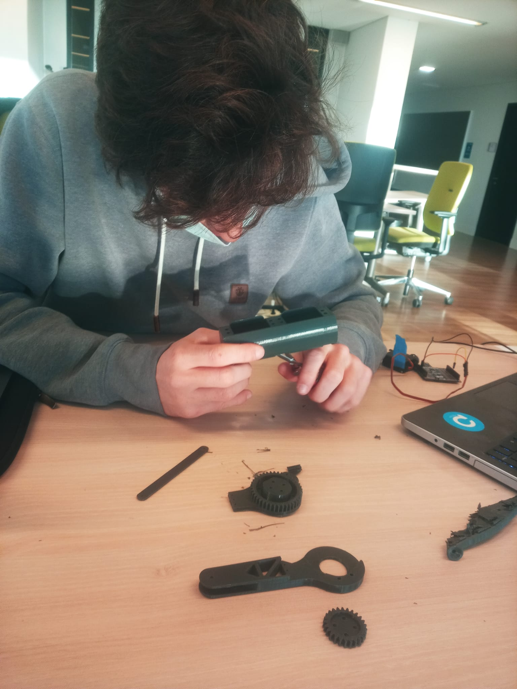
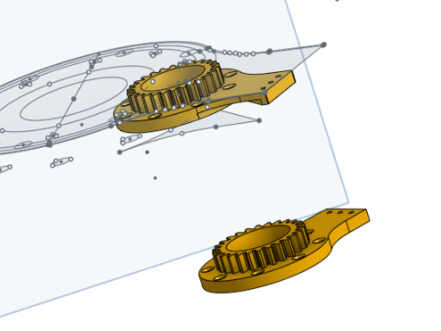
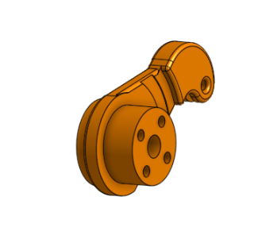
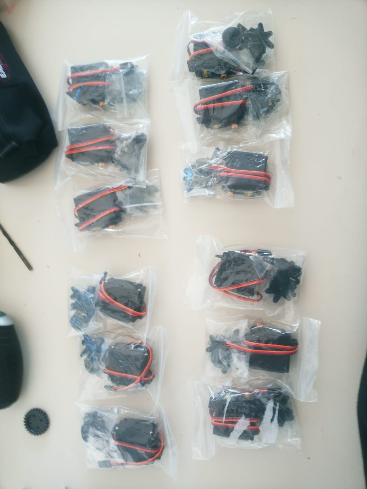

# Séance du 13/01/2022

Nous avons récupéré nos pièces au fablab le lundi matin. Nous avons commencé à nettoyer les pièces, en grattant les renflements remplis de plastique.

Pas une mince affaire !

## Premier assemblage de la patte version1

Les moteurs rentrent pile poil à l'intérieur du boitier de la patte. C'était nickel.

Nous avons assemblé le tout au fablab avec les vis et écrous adaptés. Nous avons omis de faire un trou pour la vis du milieu pour l'embout qui se fixe sur l'axe de rotation du moteur. Un coup de perceuse et ni vu ni connu.

On avait hate de commencer à pouvoir bouger la patte avec un petit code de fortune et voir comment tout cela se comporte :

J'ai lancé un code avec deux angle 170 et 10 degré. Sauf que je me suis rendu compte rapidement que ce n'était pas un réel 180 degré de liberté, puisque la transmission de l'engrenage avec un pignons 25 dents vers un de 40 dents, me donnait un max de 90 degré de liberté.

Extrêmement déçu, deux solutions, obtenir un moteur 360, ce qui me permettait de ne pas chambouler toutes les pièces déja imprimé ou remodeliser pour équilibrer le nombre de dents de chaque coté. 

## Impression et assemblage de la patte version2

Etant impossible la première option, j'ai modifié les pièces pour réduire le pignon. Placé les trous pour les vis sur le bord exterieur : 

Nous avons réimprimer toutes les pièces impactés par le changement le mercredi matin. 

Jeudi matin nous avons de nouveau décortiqué les pièces. Assemblé. Vissé. 

## Correction d'un léger soucis

De nouveau, un léger problème, j'avais fait en sorte que le frottement entre le genou et la hanche soit minimum, seulement, a la fin la hanche était trop movible lateralement. J'ai augmenter le diamètre du cercle du genou pour eviter ce problème :

## La patte est prete

Nous sommes fier de vous présenter :

Cela marche, on se laisse une journée pour effectuer des test, Raph se lance dans le code, il s'assure que rien ne cloche. 

Pendant ce temps, je suis allé couper a la scie, les bout de barre de fer, qui serviront de maintient du boitier de la patte, comme ci dessous :

J'ai pu recuperer egalement 12 moteurs MG9996 flambant neuf :

Nous lancerons l'impression des autres pattes très prochainement, peut être demain.